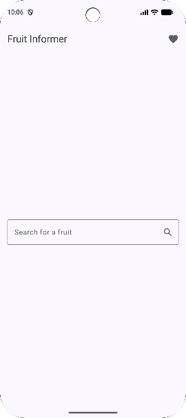
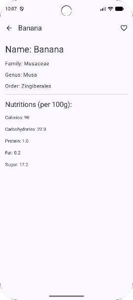
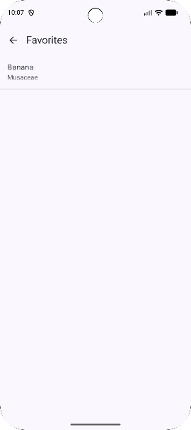

# Fruit Informer 🍎🍌🍇

Universidade Federal do Ceará
Disciplina: Programação para Dispositivos Móveis 
Professor: Windson Viana
Autor: Rodrigo Rodrigues Santos

**Fruit Informer** is a modern Android application built with Jetpack Compose that allows users to search for nutritional information about various fruits and manage a list of their favorites.

## 📱 Features

*   **Search Fruits:** Look up detailed information about any fruit.
*   **Detailed Insights:** View taxonomic classifications (family, genus, order) and nutritional values (calories, carbohydrates, protein, fat, sugar).
*   **Favorites:** Save your preferred fruits for quick access later.
*   **Modern UI:** A clean and responsive user interface built with Material Design 3.

## 🖼️ Screenshots
### Search Screen


### Fruit Detail Screen


### Favorites Screen



### App Video


## 🛠️ Technologies Used

*   **Language:** [Kotlin](https://kotlinlang.org/)
*   **UI Framework:** [Jetpack Compose](https://developer.android.com/jetpack/compose)
*   **Architecture:** MVVM (Model-View-ViewModel)
*   **Dependency Injection:** [Hilt](https://dagger.dev/hilt/)
*   **Navigation:** [Navigation Compose](https://developer.android.com/jetpack/compose/navigation)
*   **RESTful API Consumption:** [Retrofit](https://square.github.io/retrofit/) for making REST requests and [Gson](https://github.com/google/gson) for JSON parsing.
*   **Concurrency:** Kotlin Coroutines & Flow
*   **Local Storage:** SharedPreferences (for saving favorites)
*   **API:** [Fruityvice API](https://www.fruityvice.com/)

## 🚀 Getting Started

### Prerequisites
*   Android Studio Ladybug or newer.
*   JDK 17 or newer.

### Installation

1.  **Clone the repository:**
    ```bash
    git clone https://github.com/yourusername/fruitInformer.git
    ```
2.  **Open in Android Studio:**
    Open Android Studio and select "Open an existing Android Studio project", pointing to the cloned directory.
3.  **Build and Run:**
    Wait for Gradle to sync, then run the app on an emulator or physical device.

## 📂 Project Structure

*   `di`: Hilt modules for dependency injection.
*   `ui/screens`: Composable functions representing the app's screens (Search, Detail, Favorites).
*   `ui/viewmodel`: ViewModels managing UI state and business logic.
*   `data/remote`: Network configuration and API interfaces.
*   `data/repository`: Repository pattern implementation for data handling.
*   `data/model`: Data classes representing the API response.
